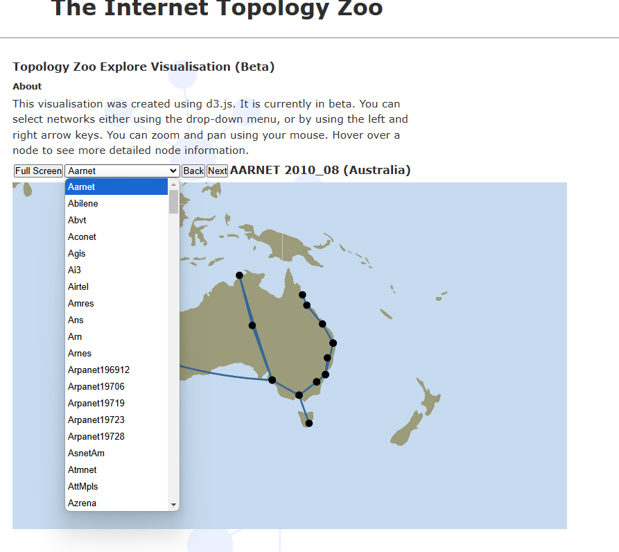
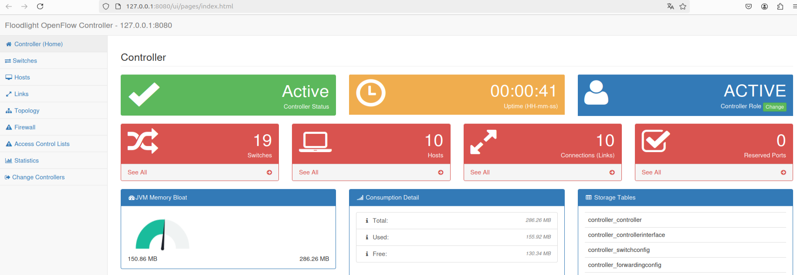
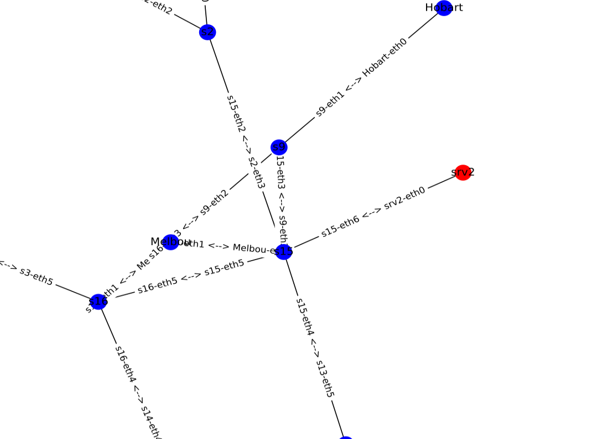
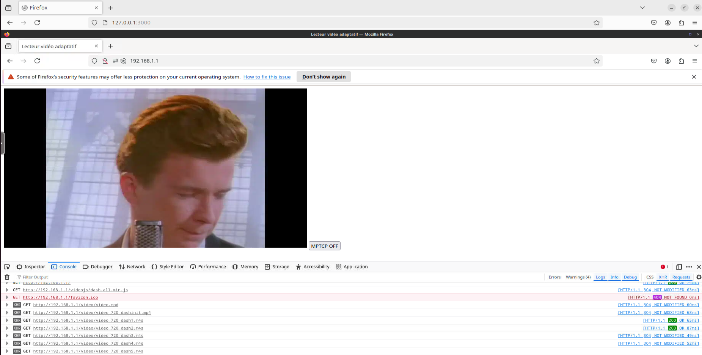
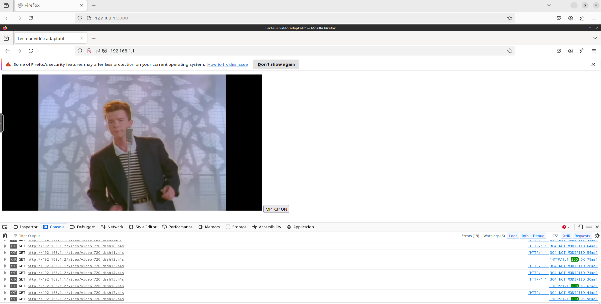
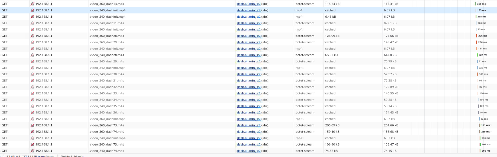
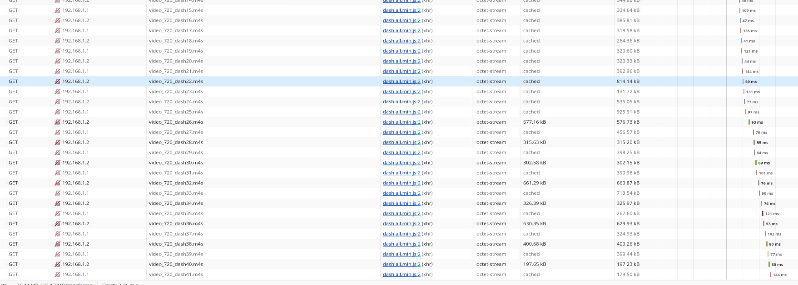

# Résilience d'un système vidéo contenairisé utilisant MPTCP en environnement SDN face aux fluctuations de bande passante

[](https://releases.ubuntu.com/noble/)
[](https://github.com/containernet/containernet)

## Introduction
  Cette plateforme développée avec **Containernet 3.1** pour **Ubuntu 24.04** permet d'étudier la résilience d'un système vidéo en **environnement SDN** face aux fluctuations de bande passante.
  De plus, elle implémente un système permettant de faire du **MPTCP avec DASH** pour étudier **l'impact de MPTC sur la QoS et la QoE** dans le streaming DASH.

## Installation
  Cette plateforme a été developpée et testée sur Ubuntu 24.04. Merci d'utiliser uniquement cette version d'Ubuntu.

  1. Pour installer la plateforme, commencer par télécharger le répertoire du projet via git ou directement en récupérant le .zip depuis Github.
     
  2. Placer le répertoire de préférence dans votre home directory

  3. Placez-vous à la racine du projet en utilisant ***cd***

  4. Lancer le script d'installation (cette opération peut prendre un certain temps en fonction de votre connexion):
 ```shell
 ./install.sh
 ```
Si vous rencontrez un problème d'installation, referez-vous au fichier de log disponible dans ***/tmp/log***
----------------

## Exemple d'utilisation
Démarrage de la simulation avec l'affichage des logs de DEBUG:
  ```shell
  ./SDN.sh start DEBUG
  ```
    
Arrêt de la simulation:
  ```shell
  ./SDN.sh stop
  ```
    
Ouverture de l'interface de perturbations d'un lien:
  ```shell
  ./SDN.sh degrade
  ```
Test du streaming adaptatif DASH:

[](https://github.com/ThomasL53/SDN-MMR/tree/master?tab=readme-ov-file#lecture-des-fichiers-vid%C3%A9os)

----------------

## Choix et format de la topologie SDN
### Topologie 'topology-zoo'
Les topologies exploitables sur cette plateforme sont celles disponibles sur **https://topology-zoo.org/**.  
Pour mettre en oeuvre une topologie, il suffit de spécifier son nom dans le programme core/start.py et core/stop.py.  
Par défaut, la topologie renseignée est **'Aarnet'**. Par exemple, si vous voulez simuler la topologie **'Renater2010'** remplacer **'Aaranet'** dans core/start.py et core/stop.py par **'Renater2010'**
Vous pouvez consulter toutes les topologies disponibles sur **https://topology-zoo.org/explore.html**


<p align="center">
	  
	
</p>


### Serveur et client (***Docker***)
Dans ces topologies, nous implémentons **deux serveurs flask** et **un client Firefox** grâce à Containernet. La déclaration de ces trois conteneurs docker se fait dans core/net.py
```python
srv = self.dockernet.addDocker('srv',ip="192.168.1.1", ports=[80],port_bindings={80:8888}, volumes=[f"{os.getcwd()}/app:/app"], dcmd="python app.py",dimage="thomasl53/webserver") 
srv2 = self.dockernet.addDocker('srv2',ip="192.168.1.2", ports=[80],port_bindings={80:9999}, volumes=[f"{os.getcwd()}/app:/app"], dcmd="python app.py",dimage="thomasl53/webserver") 
client = self.dockernet.addDocker('client',ip="192.168.1.3", ports=[3000],port_bindings={3000:3001}, dcmd="/init",dimage="thomasl53/firefox") 
```
- Le premier serveur **'srv'** est configuré avec l'adresse **192.168.1.1** dans la simulation et est accessible sur la machine hôte via une redirection sur le **port 8888**
- Le deuxième serveur **'srv2'** est configuré avec l'adresse **192.168.1.2** dans la simulation et est accessible sur la machine hôte via une redirection sur le **port 9999**
- Le client Firefox **'Client'** est configuré avec l'adresse **192.168.1.2** dans la simulation et est accessible sur la machine hôte via une redirection sur le **port 3000**
- Les deux serveurs ont accès au répertoire 'app' du projet grâce à un montage de volume '/app' sur les conteneurs docker.
- 'dmcd' correspond au point d'entrée pour les containeurs. 
- Les images utilisées sont des reconstructions d'images Docker Flask et Firefox avec l'ajout des paquets **iproute2, iputils et net-tools** pour pouvoir être configurés par Containeurnet.

### Connexion des Docker à la topologie
Pour permettre à notre plateforme de gérer de multiples topologies 'topology-zoo'. Les **switchs** auxquels sont connectés les conteneurs sont **choisis aléatoirement** dans core/net.py:
```python
randomS1 = self.net.get((random.choice(list(self.topology.switches_list.values())))) #récupération d'un switch aléatoire de la topologie
randomS2 = self.net.get(random.choice(list(self.topology.switches_list.values()))) #récupération d'un switch aléatoire de la topologie
randomS3 = self.net.get(random.choice(list(self.topology.switches_list.values()))) #récupération d'un switch aléatoire de la topologie
```

Les conteneurs sont ensuite connectés à ces switchs dans core/net.py:
```python
self.dockernet.addLink(srv,randomS1, cls=TCLink)
self.dockernet.addLink(client,randomS2, cls=TCLink)
self.dockernet.addLink(srv2,randomS3, cls=TCLink)
```

### Contrôleur SDN Floodlight
Le pilotage des switchs de la topologie est assuré par le controlleur floodlight. Une technique de **routage l2_learning** est mise en place pour pouvoir faire communiquer tous les switchs ensemble. Ce contrôleur est démarré et déclaré dans core/net:
```python
docker_command = "sudo docker run -d -p 6653:6653 -p 8080:8080 thomasl53/bretagne_floodlight"
subprocess.Popen(docker_command, shell=True)

#Construction de la topologie Mininet, ajout du controleur et démarrage
self.net = Mininet(self.topology, controller=None)
self.net.addController('c0',controller=RemoteController, ip='127.0.0.1', port=6653)

```
- Si le contrôleur n'est pas démarré, aucune connexion ne sera disponible entre les équipements.
- Grâce à l'algorithme de routage l2_learning les commutateurs OvS apprennent les adresses MAC des équipements pour acheminer efficacement le trafic.
- Si un lien est coupé ou bloqué par une règle Openflow, le routage sera automatiquement adapté
- Une fois la simulation démarrée, la page d'administration est accessible via: http://127.0.0.1:8080/ui/pages/index.html


<p align="center">
	  
	
</p>


 - Pour plus d'informations sur floodlight: https://github.com/floodlight/floodlight

***Nous utilisons pour ce contrôleur une image Docker personnalisée car les dépôts Ubuntu 24.04 n'intègrent plus toutes les bibliothèques pour Java 8.***

### Réprésentation graphique de la topologie
- Pour pouvoir être adapté à de nombreuses topologies, notre plateforme connecte les machines de façon aléatoire. 
- Pour connaître la topologie et notamment les interfaces utilisées, une vue ***'graph.svg'*** est générée à chaque démarrage de simulation. 
- Cette vue est créée dans core/net.py à partir du modèle mininet et Containernet démarré.
- NetworX avec l'algorithme **'kamada_kawai'** va générer la vue de la topologie complète avec en rouge les noeuds Dockers.

<p align="center">
	  
	
</p>

 
----------------

## Steaming vidéo adaptatif Dash
Le streaming vidéo adaptatif (DASH) est une technologie qui permet de diffuser des vidéos de manière flexible, en ajustant automatiquement la qualité en fonction de la vitesse de connexion de l'utilisateur.
### Redimensionnement des vidéos
- Pour pouvoir faire du DASH, il faut commencer par télécharger une vidéo.
- Il convient ensuite de générer des vidéos à différentes qualités. ***(Dans notre cas nous utilisons des vidéos 240p, 360p et 720p)***
Générer une version 240p :
```bash
ffmpeg -i <video_source.mp4> -vf "scale=-2:240" -c:v libx264 -b:v 400k -c:a aac -b:a 64k video_240p.mp4
```
Générer une version 360p :
```bash
ffmpeg -i <video_source.mp4> -vf "scale=-2:360" -c:v libx264 -b:v 800k -c:a aac -b:a 128k video_360p.mp4
```
Générer une version 720p :
```bash
ffmpeg -i <video_source.mp4> -vf "scale=-2:720" -c:v libx264 -b:v 2000k -c:a aac -b:a 192k video_720p.mp4
```
Dans ces commandes :
- L'option `-vf "scale=-2:240"` indique à FFmpeg de redimensionner la vidéo en conservant le rapport d'aspect pour une hauteur de 240 pixels.
- Les débits vidéo et audio sont définis avec les options `-b:v` et `-b:a`.
- Les codecs vidéo et audio utilisés sont respectivement libx264 et AAC.
### Création des chunks et du fichier MPD
- Une fois les différentes qualités générées, on peut utiliser **MP4Box** pour générer les segments et le fichier MPD. Pour installer **MP4Box**:
```bash
sudo apt install gpac
```
- On utilise ensuite la commande suivante pour créer le MPD et les chunks:
```bash
MP4Box -dash <durée des segments en ms> -rap -frag-rap -profile live -out video.mpd video_240p.mp4 video_360p.mp4 video_720p.mp4
```
### Distribution des fichiers vidéos
- Pour distribuer les fichiers vidéos, notre plateforme utilise un serveur web flask. Les vidéos doivent être placées dans le répertoire du projet app/video
- la fonction de flask ***'send_from_directory'*** permet au serveur de répondre aux requêtes de sollicitation de demande de fichier:
```python
@app.route('/video/<path:filename>', methods=['GET'], strict_slashes=False)
def send_chunk(filename):
    return send_from_directory('video', filename) 
```
### Lecture des fichiers vidéos
- Les fichiers vidéos peuvent être lus au travers de la simulation en utilisant le client Firefox (***dans la même plage d'adressage que le serveur***)
- Pour se connecter au client Firefox, ouvrez un navigateur et accédez à **http://127.0.0.1:3001**
- Dans la fenêtre qui s'ouvre accédez à **http://192.168.1.1**
- La page web utilise un lecteur vidéo dashjs (***code JavaScript du lecteur est chargé en local depuis app/videojs/***)
### Analyse du trafic vidéo
- Pour analyser le trafic vidéo, vous pouvez utiliser la console du client Firefox (***clic droit->Inspecter ou F12***).
- Désactiver 'Errors' et 'Warnings' puis activer 'XHR' et 'Requests':

<p align="center">
	  
	
</p>

### Analyse du trafic réseau
- Pour analyser le trafic réseau sur un lien de la simulation, utiliser Wireshark
- Sélectionner grâce à la vue ***'graph.svg'*** l'interface à surveiller

----------------

## Optimisation du Streaming DASH avec Multi-Path TCP (MPTCP)
Le Multi-Path TCP (MPTCP) permet d’utiliser simultanément plusieurs chemins réseau, augmentant ainsi la bande passante et la robustesse. Cette partie vise à étudier MPTCP pour optimiser le streaming DASH.

### Mise en place de l'environement
Pour mettre en oeuvre MPTCP, la méthode plus répendu est de charger dans le noyau le module MPTCP:
```bash
sudo modprobe mptcp
```
Cependant, peu de distribution fournise un noyau compilé avec ce module. Il est donc nécessaires de recompiler par vos propres moyen votre noyau.

- En raison de ces nombreuses contraintes, nous avons décider de simuler du MPTCP en chargant des chunks vidéo Dash simultanement sur deux serveurs.
- L'objectif ici est de simuler le MPTCP en chargant les chunks pairs sur le serveur 1 et les chunks impairs sur le serveur 2.
- Pour ce faire, nous avons reutiliser les chunks et le fichier MPD de notre platforme 'SDN-MMR' puis nous avons remplacer la définition des chunks `<SegmentTemplate>` par une définition `<SegmentList>` avec l'utilisation des balises `<SegmentURL>` pour spécifier le chemin de chaque chunk.
- La construction de ce fichier n'est pas possible avec FFMPEG ou MP4Box. Il faut donc le construire à la main. Pour ce faire, le programme utils/GenerateMPD permet de generate toutes les lignes 
`<SegmentURL>` pour construire tous les chemins automatiquement.
- Le fichier MPD utilisant cette technique d'alternance de chargement des chunks est disponible dans app/video/videoMPTCP.mpd

### Etude de l'impact du MPTCP
- Pour pouvoir analyser correctement l'impact de notre solution MPTCP, il nous fallait un élement de comparaison
- Nous avons donc décider de reutilliser notre plateforme permettant d'étudier le streaming adaptatif avec du SDN
- Nous avons intégrer à cette plateforme notre fichier MPD pour MPTCP est ajouter à la page web des serveurs un bouton 'MPTCP' permetant de passer rapidement d'une solution classique à une solution MPTCP
- L'utilisation d'une même plateforme nous permet de comparait DASH et DASH over MPTCP dans la même instance de la simulation. Ce qui rend les mesures plus exploitables entre les deux solutions.

### Observation du MPTCP
- Pour pouvoir observer le trafic vidéo avec MPTCP, démarrer la simulation et connecter à un des serveurs comme d'écrit dans la partie 'Lecture des fichiers vidéos'
- Clic sur le bouton 'MPTCP OFF' pour activer le MPTCP.  En suivant la partie 'Analyse du trafic vidéo' vous serez en mesure de voir les réquetes faites par le serveur pour lire un fichier video DASH avec MPTCP

<p align="center">
	  
	
</p>

- Pour obtenir plus de statisques sur la vidéo, vous pouvez aussi utiliser l'oglet 'Network' de la console de développeur Firefox. Vous pourrez alors observer la latence de chaque paquets:
- Latence sans MPTCP:

  <p align="center">
	  
	
</p>

- Latence avec MPTCP:

  <p align="center">
	  
	
</p>
- Avec une perturbations sur les liens entre le client et le serveur, on observe encore un plus grand écart en l'avantage de MPTCP entre les deux solutions.


### Observation du MPTCP avec dashJS
- Pour observer d'autre données permettant d'évaluer l'utilité de MPTCP pour le streaming adaptatif DASH, nous pouvont aussi directment utiliser les données fournises par le lecteur
- Par exemple la méthode `.getElementById("bufferLevel")` donnera l'état du tampon.
- Un exemple de page HTML qui peux être utiliser pour afficher des statistiques est disponible dans app/templates/indexStat.html
- Pour plus de détail sur les statistiques disponibles, consulter: https://dashjs.org/

### Evaluation de la QoE
- Evaluer la QoE sur cette plateforme n'est pas vraiment possible. L'utilisation d'une machine virtuelle pour démarrer une autre simulation à l'intérieur avec des conteneurs Docker rend l'expérience utilisateur fortement réduite en raison de l'environement utiliser.
- Pour évaluer la QoE, nous pensons que l'utilisation d'une plateforme physique serait beaucoup plus adapater

### Référence considérer pour MPTCP over DASH
https://dl.acm.org/doi/10.1145/2999572.2999606

https://ieeexplore.ieee.org/document/10468727

https://ieeexplore.ieee.org/document/7774599

## FAQ
- Quels indicateurs utiliser pour détecter une perte de bande passante ?
	- Taux de perte de paquets, jitter, latence, etc.
 - 
- Quel algorithme de routage dynamique utiliser ?
- 
- Comment assurer une transition fluide lors du changement de routage ?
.

